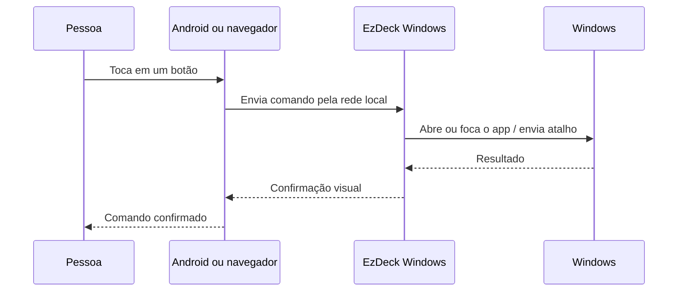

# Mapa mental do EzDeck

```mermaid
flowchart TB
  EZ[EzDeck]
  EZ --> WIN[Host Windows]
  EZ --> CLIENTES[Clientes]
  EZ --> REDE[Rede local]
  EZ --> DADOS[Dados e segurança]

  WIN --> JANELA[Janela de configuração]
  WIN --> BIBLIOTECA[Apps e atalhos]
  WIN --> BANDEJA[Ícone na bandeja]
  WIN --> INICIALIZACAO[Iniciar com Windows]
  BIBLIOTECA --> APPS[Atalhos do Menu Iniciar e Microsoft Store]
  BIBLIOTECA --> ARQUIVOS[Arquivos .exe .lnk .bat .cmd]
  BIBLIOTECA --> TECLAS[Combinações de teclado]

  CLIENTES --> ANDROID[APK Android 5.0+]
  CLIENTES --> PWA[PWA no navegador]
  CLIENTES --> IPHONE[iPhone e iPad pelo navegador]
  CLIENTES --> PAINEL[Painel de até 5 páginas]

  REDE --> DESCOBERTA[Descoberta automática UDP]
  REDE --> HTTP[HTTP para comandos e configuração]
  REDE --> WS[WebSocket para atualização rápida]
  REDE --> MANUAL[IP e porta digitados manualmente]

  DADOS --> PIN[PIN de 4 dígitos]
  DADOS --> SESSAO[Sessão do aparelho pareado]
  DADOS --> LOCAL[Configurações locais no Windows]
  DADOS --> FIREWALL[Somente rede privada]

  PAINEL --> ACOES[Abrir ou focar aplicativo]
  PAINEL --> ICONES[Ícones personalizados]
  PAINEL --> ORGANIZAR[Arrastar, reorganizar e remover]
```

## Caminho de um comando

```mermaid
sequenceDiagram
  participant U as Pessoa
  participant C as Android ou navegador
  participant H as EzDeck Windows
  participant W as Windows

  U->>C: Toca em um botão
  C->>H: Envia comando pela rede local
  H->>W: Abre ou foca o app / envia atalho
  W-->>H: Resultado
  H-->>C: Confirmação visual
  C-->>U: Comando confirmado
```
